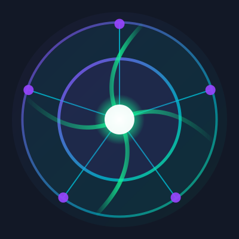

# Calctra (CAL)

<div align="center">
  
  <h3>Decentralized Scientific Computing Resource Matching Platform</h3>
  <p>Connecting Global Computing Resources, Empowering Scientific Research</p>
</div>

## Project Overview

Calctra is a decentralized scientific computing resource matching platform designed to reshape the scientific computing ecosystem. Through blockchain technology, AI-driven resource matching, and innovative economic models, Calctra is dedicated to solving global issues of uneven distribution and inefficient utilization of computing resources.

## Project Vision

Create a decentralized, efficient, and fair scientific computing ecosystem, providing unprecedented access to computing resources for researchers worldwide.

## Key Features

- **Decentralized Architecture**: No central authority, ensuring system openness and resilience
- **AI-Powered Matching**: Intelligent resource allocation based on multi-dimensional parameters, maximizing resource utilization
- **Token Economy**: Creating sustainable economic incentives through CAL tokens
- **Security & Privacy**: Advanced privacy computing framework protecting sensitive data
- **Low Entry Barrier**: Anyone with idle computing resources can become a provider
- **Global Coverage**: Breaking geographical limitations, connecting computing resources worldwide

## Technical Architecture

### Frontend Stack

- **Framework**: Next.js + React 18
- **Language**: TypeScript
- **Styling**: Styled Components
- **State Management**: React Hooks
- **Routing**: Next.js App Router
- **UI Components**: Custom component library

### Backend Stack

- **Blockchain**: Solana
- **Smart Contracts**: Anchor framework
- **Storage**: IPFS (decentralized storage)
- **API Layer**: Next.js API Routes
- **Database**: Distributed database system

### Infrastructure

- **Deployment**: Vercel
- **CI/CD**: GitHub Actions
- **Monitoring**: Prometheus + Grafana
- **Security**: Multi-layered encryption and access control

## Core Functional Modules

### 1. User Identity & Access Control

- Wallet connection and authentication
- Multi-role support (providers, consumers, validators)
- Permission management system

### 2. Resource Provision System

- Resource registration and management
- Resource specification description
- Availability settings
- Pricing strategy management
- Performance benchmarking

### 3. Demand Management System

- Computation demand publishing
- Demand specification definition
- Budget and time constraint settings
- Privacy requirement configuration

### 4. Intelligent Matching Engine

- Multi-dimensional matching algorithms
- Optimized resource allocation
- Prediction models based on historical data
- Real-time matching recommendations

### 5. Transaction System

- Smart contract transaction execution
- Multi-stage payment mechanisms
- Dispute resolution process
- Transaction history records

### 6. Computation Task Execution Framework

- Task distribution and scheduling
- Execution status monitoring
- Result verification mechanism
- Execution environment isolation

### 7. Token Economic System

- CAL token smart contracts
- Staking mechanisms
- Reward distribution
- Governance voting

## System Flow

```
┌────────────┐     ┌────────────┐     ┌────────────┐
│            │     │            │     │            │
│  Resource  ├────►│  Calctra   ├────►│   Demand   │
│  Provider  │     │  Platform  │     │   Party    │
└────────────┘     └──────┬─────┘     └────────────┘
                          │
                          ▼
                   ┌──────────────┐
                   │              │
                   │  Intelligent │
                   │  Matching    │
                   │  Engine      │
                   └──────┬───────┘
                          │
                          ▼
                   ┌──────────────┐
                   │              │
                   │  Smart       │
                   │  Contract    │
                   │  Execution   │
                   └──────┬───────┘
                          │
                          ▼
                   ┌──────────────┐
                   │              │
                   │  Task        │
                   │  Execution   │
                   │  Validation  │
                   └──────┬───────┘
                          │
                          ▼
                   ┌──────────────┐
                   │              │
                   │  Settlement  │
                   │  & Rewards   │
                   │              │
                   └──────────────┘
```

1. **Resource Registration**: Computing resource providers register their resources on the platform
2. **Demand Publishing**: Researchers publish their computational demands
3. **Intelligent Matching**: The platform automatically matches the most suitable resources
4. **Contract Creation**: Smart contracts are created to specify transaction terms
5. **Task Execution**: Resource providers execute computational tasks
6. **Result Validation**: The correctness of computation results is validated
7. **Settlement Payment**: Automatic settlement through smart contracts

## Project Roadmap

- [x] **Phase 1: Proof of Concept** (April 2025 - June 2025)
  - [x] Project vision and whitepaper
  - [x] Technical architecture design
  - [x] CAL token economic model

- [x] **Phase 2: MVP Development** (July 2025 - September 2025, Current Phase)
  - [x] Basic smart contract functionality
  - [x] Frontend user interface
  - [x] Resource provision and demand publishing features
  - [ ] Basic matching algorithm implementation

- [ ] **Phase 3: Beta Version** (October 2025 - January 2026)
  - [ ] Advanced matching algorithms
  - [ ] Decentralized storage integration
  - [ ] Community governance mechanisms
  - [ ] Security audit and optimization

- [ ] **Phase 4: Mainnet Launch** (February 2026 - May 2026)
  - [ ] Mainnet deployment
  - [ ] Global node network
  - [ ] Advanced privacy computing framework
  - [ ] Ecosystem expansion

## Quick Start

### Requirements

- Node.js 16+
- npm or yarn
- Solana CLI toolkit (optional, for blockchain interaction)

### Installation & Running

```bash
# Clone the repository
git clone https://github.com/Sol-Calctra/Calctra.git
cd calctra

# Install dependencies
npm install

# Start development server
npm run dev

# Build project
npm run build

# Start production environment
npm start
```

### Blockchain Wallet Configuration

1. Install Phantom or Solflare wallet browser extension
2. Create a Solana wallet
3. Get testnet SOL tokens
4. Connect to the application

## Developer Guide

### Directory Structure

```
calctra/
├── app/                  # Next.js application directory
│   ├── components/       # Shared UI components
│   ├── providers/        # Resource provider related pages
│   ├── marketplace/      # Marketplace and matching related pages
│   ├── dashboard/        # User dashboard
│   ├── utils/            # Utility functions
│   └── styles/           # Global styles
├── contracts/            # Solana smart contracts
├── public/               # Static assets
├── types/                # TypeScript type definitions
└── README.md             # Project documentation
```

### Key APIs

- **Resource API**: `/api/resources`
- **Demand API**: `/api/demands`
- **Matching API**: `/api/matches`
- **Transaction API**: `/api/transactions`
- **User API**: `/api/users`

## Frequently Asked Questions (FAQ)

### General Questions

**Q: What core problem does Calctra solve?**  
A: Calctra solves the problem of uneven distribution and low utilization of scientific computing resources by connecting global resource providers and consumers through a decentralized matching platform.

**Q: What advantages does Calctra have compared to traditional cloud computing services?**  
A: Decentralized architecture, more competitive pricing, global resource pool, privacy protection capabilities, and transparent incentive mechanisms.

### Technical Questions

**Q: Why choose Solana instead of other blockchains?**  
A: Solana provides high throughput and low transaction fees, particularly suitable for computing resource trading that requires frequent interactions.

**Q: How is the security and privacy of computational tasks ensured?**  
A: Through zero-knowledge proofs, homomorphic encryption, and secure multi-party computation technologies to ensure data privacy during the computation process.

### Economic Questions

**Q: What is the purpose of the CAL token?**  
A: CAL tokens are used for paying for computing resources, participating in platform governance, staking to earn rewards, and incentivizing ecosystem development.

**Q: How do resource providers set pricing?**  
A: Providers can set their own pricing strategies, with the platform providing market reference prices and dynamic pricing recommendations.

## Contributing

We welcome community contributions! Please check the [Contribution Guidelines](CONTRIBUTING.md) to learn how to participate in project development.

## Contact Us

- **Official Website**: [https://www.calctra.fun](https://www.calctra.fun)
- **GitHub**: [https://github.com/Sol-Calctra/Calctra](https://github.com/Sol-Calctra/Calctra)
- **Twitter**: [@calctra_sol](https://x.com/calctra_sol)
- **Discord**: [Calctra Community](https://discord.gg/calctra)

## License

This project is licensed under the MIT License - see the [LICENSE](LICENSE) file for details 